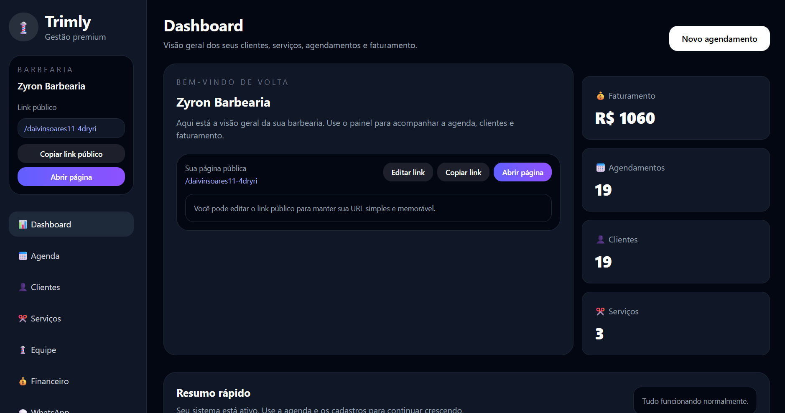
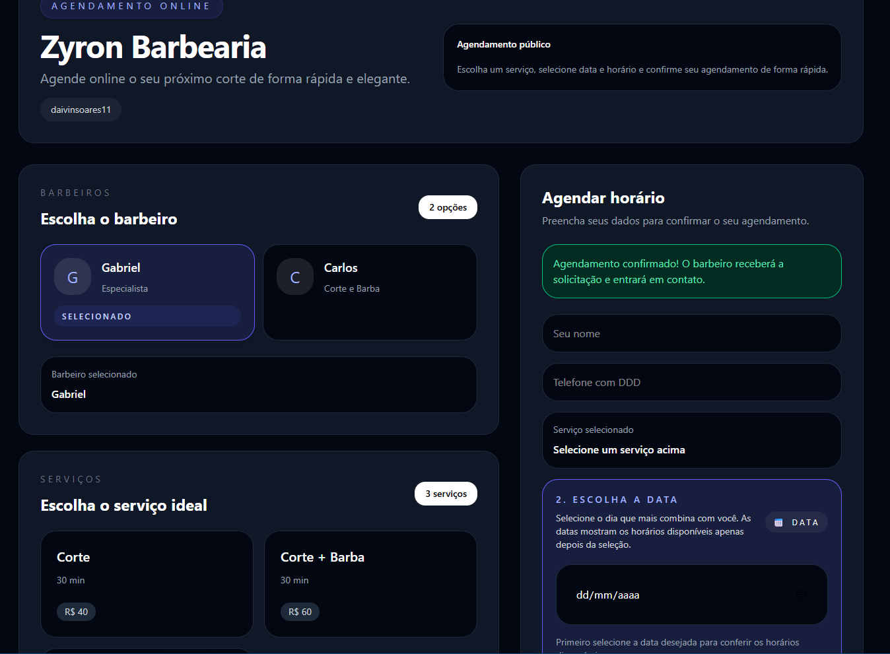
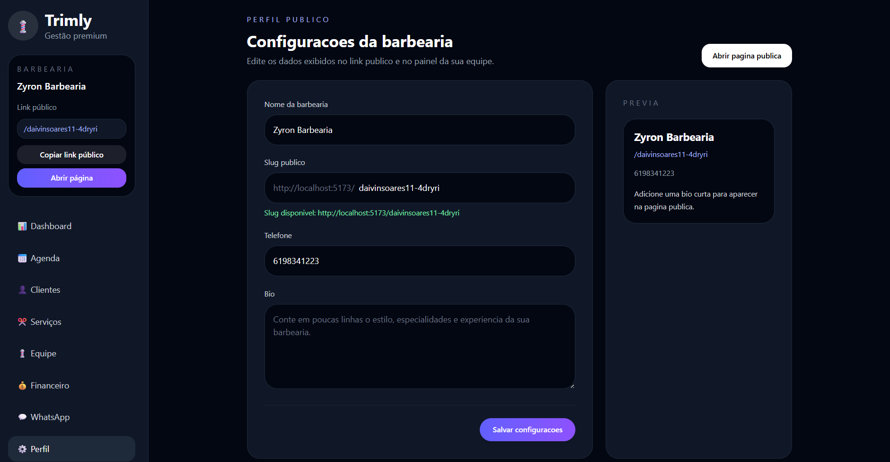

# Trimly - Gestão para Barbearias

Sistema de gestão completo para barbearias com dashboard, agenda, clientes, serviços e financeiro.

# Screenshots

## Dashboard


## Página pública


## Configuraçao


## Login


## Tecnologias

- React 19
- Vite
- Tailwind CSS
- React Router
- Firebase (Firestore)

## Instalação

1. Clone o repositório
2. Instale as dependências:
   ```bash
   npm install
   ```

3. Configure o Firebase:
   - Crie um projeto no [Firebase Console](https://console.firebase.google.com/)
   - Ative o Firestore Database
   - Copie o arquivo `.env.example` para `.env`
   - Preencha as variáveis de ambiente com suas configurações do Firebase

4. Execute o projeto:
   ```bash
   npm run dev
   ```

## Estrutura do Projeto

```
src/
├── components/     # Componentes reutilizáveis
├── pages/         # Páginas da aplicação
├── services/      # Configurações de serviços externos
└── App.jsx        # Componente principal
```

## Funcionalidades

- 📊 Dashboard com métricas gerais
- 👤 Gestão de clientes
- ✂️ Cadastro de serviços
- 📅 Agenda de agendamentos
- 💰 Controle financeiro
- 💬 Templates de WhatsApp
